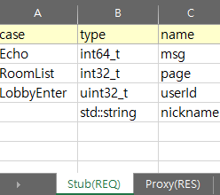
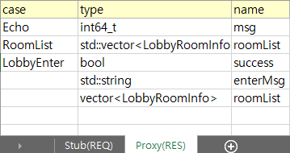

# packet-code-generator
엑셀 기반 패킷 자동 코드 생성기
패킷정의를 엑셀에 작성 -> 파싱하여 Stub(서버 패킷 핸들러)의 기본 코드를 자동으로 생성하는 유틸

## Stub 파트 (REQ)
`Packet_Config.xlsx`  

> 패킷 case에 필요한 type과 name으로 행을 추가 가능   
(새로운 case가 다음 행에 나올때까지 같은 case로 인식)

### _Auto files 생성 예시

`PacketHandler_Auto.h`
```cpp
#pragma once
#include "define.h" 
class PacketHandler_Auto
{
public:
	virtual void OnEcho(uint32_t sessionId, int64_t msg) = 0;
	virtual void OnRoomList(uint32_t sessionId, int32_t page) = 0;
	virtual void OnLobbyEnter(uint32_t sessionId, uint32_t userId, std::string nickname) = 0;
};
```

`PacketProcess_Auto.h`
```cpp
#pragma once
#include "Singleton.h"
#include "PacketHandler_Auto.h"
#include "ContentsProcess.h"

class Session;
class CPacket;

class PacketProcess_Auto : public Singleton<PacketProcess_Auto>
{
    friend class Singleton<PacketProcess_Auto>;
public:
    void Process(uint16_t type, uint32_t sessionId, CPacket& packet);

private:
    PacketProcess_Auto() : handler(ContentsProcess::Instance()) {}
	void DispatchEcho(uint32_t sessionId, CPacket& packet);
	void DispatchRoomList(uint32_t sessionId, CPacket& packet);
	void DispatchLobbyEnter(uint32_t sessionId, CPacket& packet);
    PacketHandler_Auto& handler;
};
```

`PacketProcess_Auto.cpp`
```cpp
#include "stdafx.h"
#include "PacketProcess_Auto.h"
#include "PacketHandler_Auto.h"
#include "SystemLogger.h"
#include "Session.h"
#include "CPacket.h"
#include "ContentsProcess.h"
#include "PacketDefine.h" 

using enum SystemLogger::LOG_LEVEL;

void PacketProcess_Auto::Process(uint16_t type, uint32_t sessionId, CPacket& packet)
{
    switch (type) {
	case 0: DispatchEcho(sessionId, packet); break;
	case 1: DispatchRoomList(sessionId, packet); break;
	case 2: DispatchLobbyEnter(sessionId, packet); break;
    default:
        SLog(ERROR_LEVEL, L"Packet Process default case # type is (%d)", type);
        break;
    }
}
void PacketProcess_Auto::DispatchEcho(uint32_t sessionId, CPacket& packet)
{
	int64_t msg;
	packet >> msg;
	handler.OnEcho(sessionId, msg);
}
void PacketProcess_Auto::DispatchRoomList(uint32_t sessionId, CPacket& packet)
{
	int32_t page;
	packet >> page;
	handler.OnRoomList(sessionId, page);
}
void PacketProcess_Auto::DispatchLobbyEnter(uint32_t sessionId, CPacket& packet)
{
	uint32_t userId;
	std::string nickname;
	packet >> userId;
	packet >> nickname;
	handler.OnLobbyEnter(sessionId, userId, nickname);
}

```

## Proxy 파트 (RES)

> 위와 동일 

### _Auto files 생성 예시
`PacketMaker_Auto.h`
```cpp
#pragma once
#include "CPacket.h"

void mp_Echo(CPacket& packet, int64_t msg);
void mp_RoomList(CPacket& packet, std::vector<LobbyRoomInfo> roomList);
void mp_LobbyEnter(CPacket& packet, bool success, std::string enterMsg, vector<LobbyRoomInfo> roomList);
```

`PacketMaker_Auto.cpp`
```cpp
#include "stdafx.h"
#include "PacketMaker_Auto.h"
#include "define.h"


void mp_Echo(CPacket& packet, int64_t msg)
{
	PktHeader pktHeader;
	pktHeader.Code = 0x98; 
	pktHeader.Type = 0;
	pktHeader.Len = sizeof(int64_t);
	packet.Clear();
	packet.PutData((char*)&pktHeader, sizeof(PktHeader));
	packet << msg;
}

void mp_RoomList(CPacket& packet, std::vector<LobbyRoomInfo> roomList)
{
	PktHeader pktHeader;
	pktHeader.Code = 0x98; 
	pktHeader.Type = 1;
	pktHeader.Len = sizeof(std::vector<LobbyRoomInfo>);
	packet.Clear();
	packet.PutData((char*)&pktHeader, sizeof(PktHeader));
	packet << roomList;
}

void mp_LobbyEnter(CPacket& packet, bool success, std::string enterMsg, vector<LobbyRoomInfo> roomList)
{
	PktHeader pktHeader;
	pktHeader.Code = 0x98; 
	pktHeader.Type = 2;
	pktHeader.Len = sizeof(bool) + sizeof(std::string) + sizeof(vector<LobbyRoomInfo>);
	packet.Clear();
	packet.PutData((char*)&pktHeader, sizeof(PktHeader));
	packet << success << enterMsg << roomList;
}
```

\* 현재 vector는 지원 안됨 (예시로 참고)

### 예정
- 서버 프로젝트에 빌드시 자동으로 패킷정의 엑셀파일로 _Auto 파일들을 프로젝트 디렉토리에 생성하게 환경 구축 필요
  
  